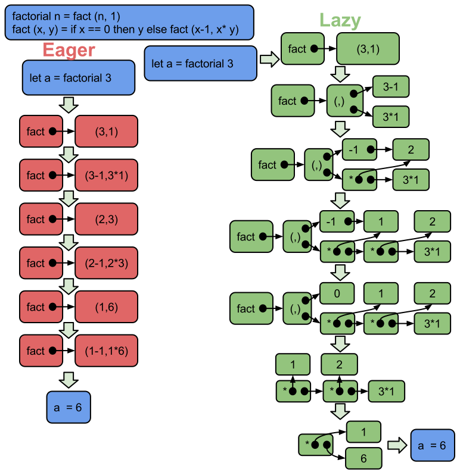

For the Purely Lazy 
=========================

The Low Down 
--------------------------
* Looking at Lazy Evaluation in the purely functional language Haskell.
* All about the lazy, purity just along for the ride.
* Wat is Lazy Evaluation?
* What is it good for?
* What are the gotchas? 

Evaluation strategies
===========================

Eager or Lazy
---------------------------

* In Haskell like languages evaluation is reducing expressions to their simplest form.   
<span style="color:lightblue">```(5 + 4 - 2) * (5 + 4 - 2) ⇒ 49```</span>

* Two options when expression includes function application.  
<span style="color:lightblue">```square (5 + 4 - 2) ⇒ 49```</span>

    * <span style="color:red"> Reduce arguments first (*Innermost reduction / Eager Evaluation*)</span>  
      <span style="color:firebrick"> ```square (5 + 4 - 2) ⇒ square(7) ⇒ 7 * 7 ⇒ 49``` </span>

    * <span style="color:limegreen"> Apply function first  (*Outermost reduction / Lazy Evaluation*)</span>  
      <span style="color:olivedrab"> ```square (5 + 4 - 2) ⇒ (5 + 4 - 2) * (5 + 4 - 2) ⇒ 7 * 7 ⇒ 49``` </span>

* Final answer == expression in normal form  
    <span style="color:lightblue">```49```</span> is the normal form of <span style="color:lightblue">```square (5 + 4 - 2)```</span>

<div class="notes">
Inner most reduction / outer most reduction from [Thinking Functionally with Haskell][] page 27.
</div>

Lazy is a bit more involved
-----------------------------------
<div style="width: 50%;float: left;">
* Outermost reduction
* Only evaluate as needed
    * Not to normal form 
    * To head normal form / weak head normal form
    * Outer most constructor
* Shares sub expressions when expanding

```haskell
square (5 + 4)
⇒ let x = 5 + 4 in square x
⇒ x * x
⇒ let x = 7 in x * x
⇒ 7*7
⇒ 49
````
```haskell
(5,square (5 + 4))
⇒ let a = 5, b = square (5 + 4) in (a,b)
````
</div>
<div style="width: 50%;float: right;">

<div>


Whats the difference
--------------------------------
<div style="width: 50%;float: left;">
Given
```haskell 
fst (a, b) = a
fst (0, square (5 + 4)) 
```
Eager
```haskell 
fst (0, square (5 + 4)) 
⇒ fst (0, square 9) 
⇒ fst (0, 9 * 9)
⇒ 0
```
Lazy
```haskell 
fst (0, square (5 + 4)) 
⇒ let a = 0, b = square (5 + 4) in fst (a, b) 
⇒ a
⇒ 0
```
Lazy never evaluated <span style="color:lightblue">```square (5 + 4)```</span> where eager did.
</div>
<div style="width: 50%;float: right;">

</div>

* * * * * *

<div style="height: 5%;float: top;">
Given
```haskell 
fst (0, ⊥) 
```
</div>
<div style="height: 95%;float: bottom;">
<div style="width: 50%;float: left;">
Eager
```haskell 
fst (0, ⊥) 
⇒ fst ⊥
⇒ ⊥
```
</div>
<div style="width: 50%;float: right;">
Lazy
```haskell 
fst (0, ⊥) 
⇒ let a = 0, b = ⊥ in fst (a, b) 
⇒ a
⇒ 0
```
</div>
</div>
<div style="height: 5%;float: bottom;">
* In the presence of bottom (⊥, undefined / non termination) 
* Lazy evaluation can still return a result
* Lazy version never evaluated the ⊥ argument.
</div>

Lazy always best! Well no.
-----------------------------
<div style="width: 30%;float: left;">
* Lazy evaluation has a bookkeeping overhead
* Unevaluated expression builds up in memory
* Eager is not always better than Lazy
* Lazy is not always better than Eager
</div>
<div style="width: 70%;float: right;">

</div>

The Good, The Bad and The Smugly
====================================

Pros and Cons
-------------------------------------

<div style="width: 50%;float: left;">
### Pros
* More efficient ? 
    * This is a red herring.
    * It could be or it couldn't. 
* Modularity! 
    * This is the real reason
    * John Hughes - [Why Functional Programming Matters][2]
    * Glue allowing composition of functional programs
* Efficient tricks for pure languages.
    * Again ? Contradiction ? Nope.
    * Memoization preserving purity and abstraction.
    * Caching preserving purity and abstraction.
</div>

<div style="width: 50%;float: right;">
### Cons
* Difficult to reason about time and space usage.
    * Time ? Not sold.
        * Lazy O(n) <= Eager O(n)
        * When is the cost? Latency is a concern.
    * Space ?
        * Unfortunately yes.
* Parallel unfriendly
    * Doing work in parallel means doing the work in parallel.
    * Have to force work to be done.
    * Only an issue if you believe in automagic parallelization.
    * See [Parallel and Concurrent Programming in Haskell][3]
</div>

<div class="notes">
[2]: http://www.cs.kent.ac.uk/people/staff/dat/miranda/whyfp90.pdf (Why Functional Programming Matters)
[3]: httP://http://community.haskell.org/~simonmar/pcph/ (Parallel and Concurrent Programming in Haskell: Techniques for Multicore and Multithreaded Programming)
</div>
