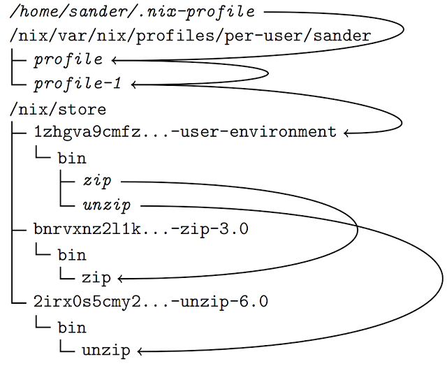
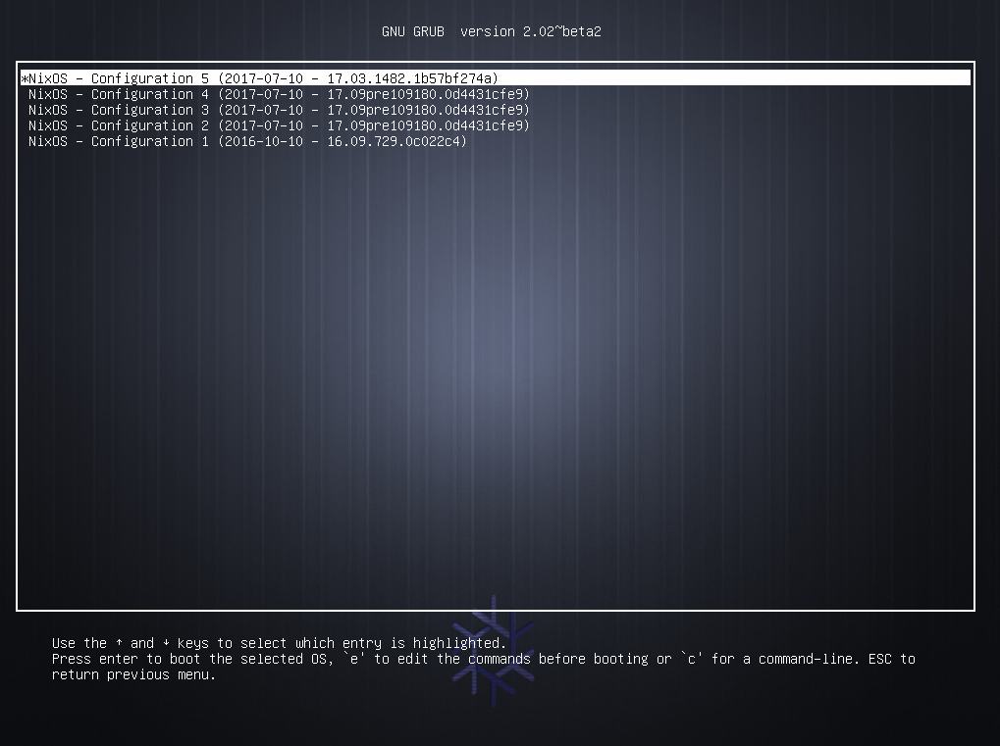

<style>
  .customize-slides h1{
    text-transform:initial;
    font-size: 200%;
  }
  section.move-up>div:nth-child(2){
    margin-top: -100px;
  }
  section.move-up-sub>div:first-child{
    margin-top: -50px;
  }
  .reveal section img.transparent-background{
    background:transparent;
    border:none;
    box-shadow:none;
  }

  div.sourceCode>pre.sourceCode{
    /*background:rgba(00, 00, 00, 0.5);*/
  }

  code{
    background:rgba(00, 00, 00, 0.5);
  }

  /*section.indent-body-2{
    padding-left: 50px;
    padding-right: 50px;
  }*/

  .smaller-list li{
    font-size:smaller;
  }
  .smaller-list p{
    font-size:smaller;
  }
  section.smaller-list div{
    font-size:smaller;
  }
</style>


<section data-background-color="#424284" data-background-image="../images/nix-wallpaper-mosaic-blue.png" data-background-size="110% 110%">
  <div> <h1 style="text-transform:initial;font-size:200%"> Adventures with the purely functional OS </h1>
  </div>
  <div> <image class="transparent-background" src="../images/nixos.svg" />  </div>
</section>


NixOS Ecology  <span style="font-variant:small-caps;font-size:70%;line-height:0.1;vertical-align:text-top"> <br/> tersely </span> {.move-up}
===================

**NixOS** is a Linux distribution based on the Nix package manager

**Nix** supports Linux, OS X and FreeBSD

**Nix** uses the purely functional **Nix Expression** language to define packages

**NixOps** uses **Nix** to deploy **NixOS** based infrastructure to Amazon Web Services, Google Cloud Platform, VirtualBox, Hetzner and NixOS containers

**DisNix** uses **Nix** to deploy distributed services

**Hydra** is a continuous integration and build cache server for **Nix**

If I told you with NixOS
========================

<section>

For those that come from *Windows*, there are no software installers

For those from *OS X*, there is no *App Store*

For those from *Linux*, it is not *FHS* compliant
<br/> no `/sbin` `/lib` `/lib64` `/usr/local` `/usr/lib`  ...
<br/> `/etc` off limits
<br/> only `/bin/sh` and `/usr/bin/env`

In general you can't install arbitrary applications or libraries from the internet

</section>

<section>

You have to learn the *Nix Expression* language

You may have to learn a little bit about purely
functional programming

If you get stuck you can't just get the answer on *AskUbuntu*

You may have to add packages to the package manager

</section>

You might ask  {data-state=""}
============

<div>

</div>

The answer is
=============

<div style="display: flex">
<div>
We do these things not because they are easy, but because they are hard
</div>
<div>
{width=500px .transparent-background}
</div>
</div>

<div class="fragment fade-in fad-up" style="display: flex">
<div>
{width=250px .transparent-background style="position:absolute; top:40%; left:20%"}
</div>
<div style="width:50%;margin-left:30%;">
and because it makes the impossibly difficult easily possible
</div>
</div>


The Nix Package Manager
================================

<section>

There is an excellent explanation of what the **Nix** package manager is on *Sander van der Burg*'s blog
[http://sandervanderburg.blogspot.co.za/2012/11/an-alternative-explaination-of-nix.html]()

and what follows is directly based on that

</section>

<section>

<div class="notes">

[Directly from Sander's blog][an-alternative-explaination-of-nix]

<blockquote>

In short: Nix is a package manager, which is a collection of software tools
to automate the process of installing, upgrading, configuring, and removing
software packages. Nix is different compared to conventional package managers,
because it borrows concepts from purely functional programming languages to make
deployment reliable, reproducible and efficient. The Nix project has been
initiated by Eelco Dolstra as part of his PhD research.

</blockquote>

</div>

Tools to automate **installing**, **upgrading**, **configuring**, and **removing** software packages

| It borrows concepts from
| **purely functional** programming languages
| to make **deployment**
| **reliable**, **reproducible** and **efficient**

Was initiated by **Eelco Dolstra** as part of his *PhD* research

</section>

<section>

<div style="margin-top:-40px"> <h4 style="font-variant:small-caps;"> Purely functional programming languages </h4> </div>

Functions are found in many programming languages

But they are usually not the same as functions in mathematics

| Leibnz' principal
| `𝑥 ＝ 𝑦 ⇒ ⨍⟮𝑥⟯ ＝ ⨍⟮𝑦⟯`
| if two function arguments are identical
| then two function applications are too

</section>

<section>
<div style="margin-top:-40px"> <h4 style="font-variant:small-caps;"> Purely functional programming languages are not</h4> </div>
<div style="display:flex;flex-direction:row;align-items:center;">
<div style="width:55%;text-align:left">
This `C` code
```{.c }
int v = 0;

int add(int a)
{
    v = v + a;
    return v;
}

int main()
{
    int p = add(1); /*1*/
    int q = add(1); /*2*/
}
```
</div>
<div>
  <p class="fragment fade-in fade-bottom" style="text-align:left">does not obey the Leibnz' principal</p>
  <p class="fragment fade-in fade-bottom" style="text-align:left">because it allows side-effects to be programmed</p>
  <p class="fragment fade-in fade-bottom" style="text-align:left">meaning it lacks referential transparency</p>
  <p class="fragment fade-in fade-bottom" style="text-align:left">so function application cannot be replaced by its result</p>
</div>
</div>

</section>

<section class="indent-body-2">
<div style="margin-top:-40px"> <h4 style="font-variant:small-caps;"> Purely functional programming languages </h4> </div>
<div style="text-align:left"> Obey the Leibnz' principal </div>

| The result of function **application**
| depends only on its **definition**
| and its **arguments**

Side-effects are not allowed to be programmed (they are pure)

No variable, only identifiers to immutable objects

This all means they are referential transparent

</section>

<section class="indent-body-2">
<div style="margin-top:-40px"> <h4 style="font-variant:small-caps;"> Purely functional programming languages </h4> </div>
<div style="text-align:left"> Are often **lazy** </div>

So expression only get evaluated when needed

Allows *tying the knot* used for cyclic data structures while retaining purity

</section>

<section class="indent-body-2">
<div style="margin-top:-40px"> <h4 style="font-variant:small-caps;"> Purely functional programming languages which are lazy</h4> </div>
<div style="text-align:left"> Have **benefits** </div>

Results of **evaluation** can be **cached**

**Evaluation** only happens **when** the result is **required**

Referential transparency gives determinism allowing **parallel evaluation**

</section>

<section>
<div style="margin-top:-40px"> <h4 style="font-variant:small-caps;"> Purely functional package management</h4> </div>

Treat deployment of packages as a function in a programming language

</section>

<section class="indent-body-2">
<div style="margin-top:-40px"> <h4 style="font-variant:small-caps;"> Conventional package management </h4> </div>
<div style="text-align:left"> In conventional package mangers </div>

A *"function"* is representative of imperative languages like *C*

Execution can destructively modify other packages

| Files **installed** in **global locations** (like `/usr/lib`),
| so **dependencies** could be found **without being declared** and
| its **difficult** for **multiple version** of a package to **co-exist**

</section>

<section class="indent-body-2">
<div style="margin-top:-40px"> <h4 style="font-variant:small-caps;"> Purely functional package management</h4> </div>
<div style="text-align:left"> In Nix </div>

| A **build recipe** / **derivation** is
| a **function** that describes **how to build** an artefact
| being invoked with its **required dependencies as arguments**

| **Build recipes** defined with the **Nix Expression DSL**
| (which is a lazy purely functional language)

**Build recipes** are run in **isolated environments limiting** chances of **side effects**

</section>

<section class="indent-body-2">
<div style="margin-top:-40px"> <h4 style="font-variant:small-caps;"> Purely functional package management</h4> </div>
<div style="text-align:left"> In Nix </div>

The **result** of each build is **stored** in a **unique separate location**

The **storage** locations are **immutable**

| The storage **identity** is a **cryptographic hash**
| derived from all the **inputs of the function**

**Unique locations** give better **guarantees against implicit dependencies** sneaking through

</section>

<section class="indent-body2">
<div style="margin-top:-40px"> <h4 style="font-variant:small-caps;"> Purely functional package management</h4> </div>
<div style="text-align:left;"> This means in Nix </div>

You get **determinism**, the same package is the same where or when ever you install it

You can have **multiple versions** of packages **co-existing**

You can **safely upgrade** any package and **always rollback** an upgrade

You can **in-place upgrade** packages

</section>

NixOS
===========

<section>

**NixOS** is a GNU/Linux distribution built around the **Nix** package manager

It builds on **Nix** using the **Nix Expression** DSL to **declaratively define** every component
including the **kernel** and **configuration files**

It uses **systemd** for services which are declaratively defined using the **Nix Expression** DSL.

| It uses a **source based** model **with binaries**,
| that is cached binaries are used instead of building from source when possible

</section>

<section>

| **NixOS** gives you determinism;
| the same configuration builds the same machine no matter when or where

**NixOS** is gives you **relaible atomic upgrades**

**NixOS** allows you to always **rollback** any changes

**NixOS** allows you to **safely live upgrade** your system

</section>

Nix Expression Language
==========================

<section>
<div style="margin-top:-40px"> <h4 style="font-variant:small-caps;"> It is a pure, lazy, functional language </h4> </div>

Purity means no side-effects (e.g. no variable assignment)

Laziness means function arguments are only evaluated when needed

Functional means functions are first class and can be passed around and manipulated

The language is not full-featured and general purpose

Its aim is describing packages, compositions of packages and variability within packages

</section>

<section>
<div style="margin-top:-40px"> <h4 style="font-variant:small-caps;"> Comments </h4> </div>
<div>
| Comments can be
| single-line, started with a `#` character, or
| inline/multi-line, enclosed within `/* ... */`

```nix
# this is a line comment
/* this
is a multiline comment */
```
</div>
</section>

<section>
<div style="margin-top:-40px"> <h4 style="font-variant:small-caps;"> Simple Values </h4> </div>

<div style="margin-top:-30px">
* The null value `null`
* Integers `1234`
* Booleans `true` and `false`
* Strings
```nix
"single line string"
''
  First line of a multiline string.
  Second line
''
"this is an ${antiquote} in a string"
```
    * as a convenience URIs don't need quotes
    ```nix
    http://example.org/foo.tar.bz2
    ```
* Paths `/bin/sh` or `./builder.sh`

</div>

</section>

<section>
<div style="margin-top:-40px"> <h4 style="font-variant:small-caps;"> Lists </h4> </div>

<div>

```nix
[123 ./foo.nix "abc" (f {x = y;}) ]
```
* heterogeneous list
* white space delimited list of values
* enclosed by square brackets

</div>
</section>

<section>
<div style="margin-top:-40px"> <h4 style="font-variant:small-caps;"> Sets </h4> </div>

<div>

```nix
{ x = 123;
  text = "Hello";
  y = f { bla = 456; };
}
```

* heterogeneous dictionary
* list of name value pairs called attributes
* delimited by semicolon
* enclosed by curly brackets
* attributes selected using `.`
```nix
{ a = "Foo"; b = "Bar"; }.a
```
* in recursive sets elements can refer to each other
```nix
rec {x = y; y = 123;}.x == 123
```

</div>
</section>

<section>
<div style="margin-top:-40px"> <h4 style="font-variant:small-caps;"> Let-expressions </h4> </div>
<div>

Allows you to introduce local variables for an expression

```nix
let
  x = "foo";
  y = "bar";
in x + y
```

</div>
</section>

<section>
<div style="margin-top:-40px"> <h4 style="font-variant:small-caps;"> Inheriting attributes </h4> </div>

When defining sets its often convenient to copy variable from the surrounding scope

```nix
let x = 123; in
{ inherit x;
  y = 456;
}
```

or from another set

```nix
let aset = {x = 123, q = 456}; in
{ inherit (aset) x;
  y = 456;
}
```

both evaluates to

```nix
{ x = 123; y = 456; }
```

</section>

<section>
<div style="margin-top:-40px"> <h4 style="font-variant:small-caps;"> With-expressions </h4> </div>
<div>

```nix
with e1; e2
```

</div>

introduces the set `e1` into the lexical scope of expression `e2`

```nix
let as = { x = "foo"; y = "bar"; };
in with as; x + y
```

</section>

<section>
<div style="margin-top:-40px"> <h4 style="font-variant:small-caps;"> Functions </h4> </div>

Functions take a single argument with multiple arguments supported through currying

| Its defined as an argument pattern followed by a body
| `pattern: body`


| Function application is white space
| `f x`

```nix
let negate = x: !x;
    concat = x: y: x + y;
in if negate true then concat "foo" "bar" else ""
```
</section>

<section>
<div style="margin-top:-40px"> <h4 style="font-variant:small-caps;"> Functions </h4> </div>
<div>

set patterns are supported

```nix
{ x, y, z }: z + y + x
```
</div>

<div class="fragment fade-in fade-up">
including variable binding, default values for missing keys and partial matches
```nix
args@{ x, y ? "default", z, ... }: z + y + x + args.a
```
</div>

</section>


<section>
<div style="margin-top:-40px"> <h4 style="font-variant:small-caps;"> Conditionals </h4> </div>
<div>

Doesn't really need explaining

```nix
if e1 then e2 else e3
```

</div>
</section>

<section>
<div style="margin-top:-40px"> <h4 style="font-variant:small-caps;"> Operators </h4> </div>
<div>

```nix
e.attrpath    # select attribute
e1 e2         # call function
e ? attrpath  # test attribute existance
e1 ++ e2      # list concatenation
e1 + e2       # list or path concatenation
!e1           # boolean negation
e1 // e2      # set union
e1 == e2      # equality
e1 != e2      # inequality
e1 && e2      # logical AND
e1 || e2      # logical OR
e1 -> e2      # logical implication (!e1 || e2)
```
</div>
</section>

<section>
<div style="margin-top:-40px"> <h4 style="font-variant:small-caps;"> Default builtin functions </h4> </div>
<div>

* There are some default builtin functions
* The most important being `import`
    * which loads a Nix Expression from a file
    * and if the expression is a function
    * allows you to call it immediately

</div>
</section>

Nix Hello World
===============

<section>

Nix expressions that actually get built are **derivations**

<div class="fragment fade-in fade-up">
Here is the example derivation for building GNU Hello
```nix
{stdenv, fetchurl}:

stdenv.mkDerivation {
  name = "hello-2.6";

  src = fetchurl {
    url = ftp://ftp.gnu.org/gnu/hello/hello-2.6.tar.gz;
    sha256 = "1h6fjkkwr7kxv0rl5l61ya0b49imzfaspy7jk9jas1fil31sjykl";
  };

  meta = {
    homepage = http://www.gnu.org/software/hello/manual/;
    license = "GPLv3+";
  };
}
```
</div>

</section>

<section class="smaller-list">
<div style="margin-top:-40px">

```{.nix style="font-size:larger"}
{stdenv, fetchurl}:

stdenv.mkDerivation {
  name = "hello-2.6";

  src = fetchurl {
    url = ftp://ftp.gnu.org/gnu/hello/hello-2.6.tar.gz;
    sha256 = "1h6fjkkwr7kxv0rl5l61ya0b49imzfaspy7jk9jas1fil31sjykl";
  };

  meta = {
    homepage = http://www.gnu.org/software/hello/manual/;
    license = "GPLv3+";
  };
}
```
</div>

<div>
* function taking a set with attributes `stdenv` and `fetchurl`
* returns a derivation
    * specifying the package's name, source and meta info
    * not specifying build procedure so standard Autotools will be used `./configure; make; make install`
</div>

</section>


<section class="smaller-list">
<div style="margin-top:-40px">

to build *hello* we compose its function with its arguments

```{.nix style="font-size:larger"}
rec {
  stdenv = ...;
  fetchurl = import ../build-support/fetchurl {
    inherit stdenv curl;
  };
  hello = import ../applications/misc/hello {
    inherit stdenv fetchurl;
  }
  ...
}
```
</div>

<div>
* The `hello` attribute is bound to the function defined earlier and invoked with its arguments
* The dependencies of the function are themselves defined in the set
* Essentially in **Nix one recursive set defines all packages and dependencies** in terms of each other
</div>

</section>

<section class="smaller-list">
<div>

When you install `hello` the following paths will be added to the Nix store

* The derivation that describes how to build `/nix/store/vh0mxra4c7jrdg2fi5yn83k5kwdflsbx-hello-2.6.drv`
* The source code fetched that was fetched  `/nix/store/agjbqxl2n6yhqwcarx9shdbsc13dgwk0-hello-2.6.tar.gz.drv`
* The actual final binary `/nix/store/1gqj6zr1x0n812qxijy066fzrypgh3im-hello-2.6`

</div>

Everything is **cached** so they won't be downloaded again or build again if something else requires it

</section>

Nix Profiles
================

<section>

<div> So if all artefacts live the Nix store won't it make using it difficult </div>

The answer is **Nix profiles** and again a very good explanation can be found on Sander's blog
[http://sandervanderburg.blogspot.co.za/2013/09/managing-user-environments-with-nix.html]()

</section>

<section>

<div>
**Nix profiles** are user environments exposing a generation of installed packages to a user

* Packages can be installed into profiles using <br/>`nix-env` command line utility
```shell
$ nix-env -i zip unzip
```
* Installed packages can be run as normal without specifying paths with hash codes
```shell
$ zip --version
Copyright (c) 1990-2008 Info-ZIP - Type 'zip "-L"' for software license.
This is Zip 3.0 (July 5th 2008), by Info-ZIP.
Currently maintained by E. Gordon.  Please send bug reports to
the authors using the web page at www.info-zip.org; see README for details.
```
</div>

</section>

<section>

<div>
When you install packages a new profile is created
</div>

A profile is a symlink tree synthesizing the contents
of the currently installed packages

</section>

<section>

<div style="margin-top:-40px">

A user environment / profile is also a Nix package residing in the store

{style="width:60%"}

</div>

</section>

<section class="smaller-list">

<div style="display:flex;flex-direction:row;align-items:flex-start;">
<div style="width:100%">
{}
</div>

<div>
* A generation symlink is generated (profile-1)
* There is a default symlink (profile) pointing to the currently active generation
* The default symlink is also referenced from the user's home directory through `~/.nix-profile` 
* Paths are added to the user's `PATH` by e.g. `export PATH=~/.nix-profile/bin:$PATH`
</div>

</div>
</section>

<section>
<div>
Deployment actions are actually non destructive

* if you install or remove packages with `nix-env` new profiles are created
* you can always revert to a previous profile using `nix-env --rollback`
* to actually remove old profiles <br/>`nix-env --delete-generations old`
* and to actually physically remove files from the store `nix-collect-garbage`

</div>
</section>

A minimal NixOS machine
=========================

<section>
<div style="font-size:50%;margin-top:-40px">
```{.nix .stretch}
{ config, pkgs, ... }:
{
  imports =
    [ # Include the results of the hardware scan.
      ./hardware-configuration.nix
    ];

  # Use the GRUB 2 boot loader.
  boot.loader.grub.enable = true;
  boot.loader.grub.version = 2;
  boot.loader.grub.device = "/dev/sda";

  networking.hostName = "example-machine";

  # List packages installed in system profile
  environment.systemPackages = with pkgs; [
    wget
    termite
    nvim
  ];

  # List services that you want to enable:
  services.openssh.enable = true;
  networking.firewall.enable = false;

  # Enable the X11 windowing system.
  services.xserver.enable = true;
  services.xserver.layout = "us";

  # Enable the KDE Desktop Environment.
  services.xserver.displayManager.sddm.enable = true;
  services.xserver.desktopManager.plasma5.enable = true;

  # Define a user account. Don't forget to set a password with ‘passwd’.
  users.extraUsers.a_user = {
    isNormalUser = true;
    uid = 1000;
    home = "/home/a_user";
    extraGroups = ["wheel" "audio" "video" "networkmanager" "postgres" "vboxusers"];
    initialPassword = "a_user";
  };

  # The NixOS release to be compatible with for stateful data such as databases.
  system.stateVersion = "17.09";

  # virtual box related
  boot.initrd.checkJournalingFS = false;
  virtualisation.virtualbox.guest.enable = true;
}
```
</div>
</section>

<section>
<div>
```{.nix }
{ config, pkgs, ... }:
{
  imports =
    [ # Include the results of the hardware scan.
      ./hardware-configuration.nix
    ];
......
```

* The configuration is a function that lives in `/etc/nixos/configuration.nix`
* It imports the auto generated `hardware-configuration.nix`
</div>
</section>

<section>
<div>

```
......
  # Use the GRUB 2 boot loader.
  boot.loader.grub.enable = true;
  boot.loader.grub.version = 2;
  boot.loader.grub.device = "/dev/sda";

  networking.hostName = "example-machine";

  # List packages installed in system profile
  environment.systemPackages = with pkgs; [
    wget
    termite
    neovim
  ];
......
```

* some boot options
* the machine name
* some packages to be installed in the root profile

</div>
</section>

<section>
<div>

```nix
......
  # List services that you want to enable:
  services.openssh.enable = true;
  networking.firewall.enable = false;

  # Enable the X11 windowing system.
  services.xserver.enable = true;
  services.xserver.layout = "us";

  # Enable the KDE Desktop Environment.
  services.xserver.displayManager.sddm.enable = true;
  services.xserver.desktopManager.plasma5.enable = true;
......
```
* list some services to have enabled
* specify the desktop environment
</div>
</section>

<section>
<div>
```nix
......
  # Define a user account. Don't forget to set a password with ‘passwd’.
  users.extraUsers.a_user = {
    isNormalUser = true;
    uid = 1000;
    home = "/home/a_user";
    extraGroups = ["wheel" "audio" "video" "networkmanager" "postgres" "vboxusers"];
    initialPassword = "a_user";
  };
......
```
Define the users of the system
</div>
</section>

<section class="smaller-list">

<div style="display:flex;flex-direction:row;align-items:center;">
<div style="width:150%">

</div>
<div>
* If you want to try out changes without making it permenant <br/>`sudo nixos-rebuild test`
* If you are happy and want to switch to the new configuration <br/>`sudo nixos-rebuild switch`
* If you want to rollback changes <br/>`sudo nixos-rebuild rollback`
* If you accidentally make your system non-bootable you can still boot into any previous
  config from the grub menu.
</div>
</div>
</section>

Developing with Nix
====================

<section>

<div> When developing software you want environments setup with all your development dependencies present </div>

If you work on different sets of software you don't want the dependencies to interact

In Nix you use the `nix-shell` command to enter a development environment with all your dependencies setup.
</section>

<section>
<div> Usually a software package like *hello* are defined by a `default.nix` in a folder named after it </div>

This file defines a function though that needs to be invoked with its environment

This is where the `shell.nix` file comes in which `nix-shell` uses by default

The `shell.nix` file sets up the environment and then calls the `default.nix` file

</section>

<section class="smaller-list">
<div>

* directory `hello`
* default.nix
    ```{.nix style="font-size:larger"}
    {stdenv, fetchurl}:

    stdenv.mkDerivation {
      name = "hello-2.6";

      src = fetchurl {
        url = ftp://ftp.gnu.org/gnu/hello/hello-2.6.tar.gz;
        sha256 = "1h6fjkkwr7kxv0rl5l61ya0b49imzfaspy7jk9jas1fil31sjykl";
      };

      meta = {
        homepage = http://www.gnu.org/software/hello/manual/;
        license = "GPLv3+";
      };
    }
    ```
* shell.nix
    ```{.nix style="font-size:larger"}
    let
      pkgs = import <nixpkgs> {};
    in import ./default.nix {inherit (pkgs) stdenv fetchurl;}
    ```
</div>
</section>

<section>
<div>
```{.nix}
let
  pkgs = import <nixpkgs> {};
in import ./default.nix {inherit (pkgs) stdenv fetchurl;}
```

* import the top level nix packages expression
* import `./default.nix`
* call the function passing in `stdenv` and `fetchurl` from the top level nix expression
</div>
</section>

<section>
<div>
In the `hello` directory run `nix-shell`

* This drops you in a development shell
* All your build dependencies are present
* to unpack the fetched source run `unpackPhase`
* then cd into the source directory and run `./configure` and `./make`
</div>
</section>

Adhoc Build Environments
==========================

<section>
<div> Sometimes you just want adhoc build environments in which to experiment </div>
You can easily do this by creating "fake" build recipes and using `nix-shell` to setup your
environments
</section>

<section>
<div style="margin-top:-40px"> <h4 style="font-variant:small-caps;"> Haskell Hakyl Environment </h4> </div>
<div>
```{.nix .stretch style="font-size:85%"}
let
  pkgs = import <nixpkgs> {};
  haskellPackages = pkgs.haskellPackages.override {
    overrides = self: super: with pkgs.haskell.lib;{
      ghc-syb-utils = dontCheck super.ghc-syb-utils;
  };};
  ghcWithPackages =
    haskellPackages.ghcWithHoogle (g: with g;
    [classy-prelude hakyll hakyll-favicon hakyll-filestore
     hakyll-ogmarkup hakyll-series base pandoc pandoc-types
    ]);
in with pkgs;
  runCommand "hakyll-env"
    (with ghcWithPackages.haskellPackages;
      rec
        { ghc = ghcWithPackages;
          shellHook = "eval $(egrep ^export ${ghc}/bin/ghc)";
          buildInputs =
            [ ghcWithPackages zsh ghc-mod hindent cabal-helper
              cabal-install codex stylish-haskell hoogle hlint
              align netcat-openbsd hdevtools];})
  "echo success > $out"
```
</div>
</section>

<section>
<div style="margin-top:-40px"> <h4 style="font-variant:small-caps;"> Haskell Hakyl Environment </h4> </div>
<div>

```{.nix .stretch}
let
  pkgs = import <nixpkgs> {};
  haskellPackages = pkgs.haskellPackages.override {
    overrides = self: super: with pkgs.haskell.lib;{
      ghc-syb-utils = dontCheck super.ghc-syb-utils;
  };};
...
```
* we import the top level nix expression
* we then override the `ghc-syb-utils` package skipping its test suite
</div>
</section>

<section>
<div style="margin-top:-40px"> <h4 style="font-variant:small-caps;"> Haskell Hakyl Environment </h4> </div>
<div>
```{.nix .stretch}
  ghcWithPackages =
    haskellPackages.ghcWithHoogle (g: with g;
    [classy-prelude hakyll hakyll-favicon hakyll-filestore
     hakyll-ogmarkup hakyll-series base pandoc pandoc-types
    ]);
```
Then we create a special **GHC** that has the specified libraries available along with a custom **Hoogle** and documentation
</div>
</section>

<section class="smaller-list">
<div style="margin-top:-40px"> <h4 style="font-variant:small-caps;"> Haskell Hakyl Environment </h4> </div>
<div>
```{.nix .stretch style="font-size:larger"}
in with pkgs;
  runCommand "hakyll-env"
    (with ghcWithPackages.haskellPackages;
      rec
        { ghc = ghcWithPackages;
          shellHook = "eval $(egrep ^export ${ghc}/bin/ghc)";
          buildInputs =
            [ ghcWithPackages zsh ghc-mod hindent cabal-helper
              cabal-install codex stylish-haskell hoogle hlint
              align netcat-openbsd hdevtools];})
  "echo success > $out"
```
* we specify our "fake" derivation
* we setup some environment variables for **GHC** on shell entry in `shellHook`
* we list all the tools we want in our `buildInputs` attribute

</div>
</section>

<section class="smaller-list">
<div style="margin-top:-40px"> <h4 style="font-variant:small-caps;"> Clang Environment </h4> </div>
<div>
```{.nix .stretch style="font-size:105%"}
let
  pkgs = import <nixpkgs> {};
in with pkgs;
clangStdenv.mkDerivation rec
{ name = "cpp-play-${version}";
  version = "0.0.0";
  buildInputs =
    [clang clang-tools llvmPackages.libcxx llvmPackages.libcxxabi glibc gdb];
  CPLUS_INCLUDE_PATH =
    "${llvmPackages.libcxx}/include/c++/v1:${clangStdenv.cc.libc_dev}/include";
  C_INCLUDE_PATH = "${clangStdenv.cc.libc_dev}/include";
  LD_FLAGS =
    "-L${llvmPackages.libcxx}/lib -L${llvmPackages.libcxxabi}/lib";
}
```
all attributes are defined as environment variables in the shell

antiquoting a package results in its final stored location
</div>
</section>

Pegging Build Environment
==========================

<section>
<div>For production development you want to ensure that all developers
use the same top level nix expression</div>
</section>

<section class="smaller-list">

<div style="margin-top:-40px">
Given file `hello/pegged-nix.nix`
```nix
# helper to fetch nix-expression
let fetchFromGitHub = (import <nixpkgs> {}).fetchFromGitHub;
# fetch the nix expression from github at the specified revision
in import
    ( fetchFromGitHub
      {
        owner = "NixOS";
        repo = "nixpkgs";
        rev = "2839b101f927be5daab7948421de00a6f6c084ae";
        sha256 =
          "0a863cc5462gn1vws87d4qn45zk22m64ri1ip67w0b1a9bmymqdh";
      }
    ) {}
```
</div>

Then hello can be called in `hello/shell.nix` using the pegged nix packages
```{.nix}
let
  pkgs = import ./pegged-nix.nix ;
in import ./default.nix {inherit (pkgs) stdenv fetchurl;}
```
</section>

<div class="notes">
[an-alternative-explaination-of-nix]: http://sandervanderburg.blogspot.co.za/2012/11/an-alternative-explaination-of-nix.html
[tying-the-knot]: https://wiki.haskell.org/Tying_the_Knot
[nix-expression-language]:https://nixos.org/nix/manual/#ch-expression-language
</div>
